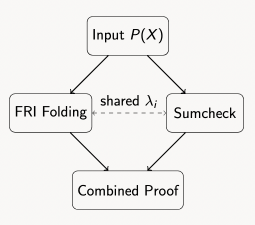

# Overview

The Fast Reed-Solomon Interactive Oracle Proofs of Proximity (FRI) protocol, introduced in 2018, brought significant advances to zero-knowledge cryptography through its innovative polynomial folding technique. By progressively reducing the degree of committed polynomials, FRI achieved remarkable efficiency gains in verifier costs, making it a cornerstone of STARK proof systems.

However, FRI's original design was optimized for univariate polynomials $p(X) ∈ F[X]$, limiting its direct applicability to multivariate polynomials $P(X₁,...,Xₙ) ∈ F[X₁,...,Xₙ]$. This constraint posed challenges for proof systems that needed to handle more complex computational statements.

The BaseFold protocol addresses this limitation by extending FRI's folding technique to multivariate polynomials. It cleverly combines FRI's efficiency with the well-established sumcheck protocol, using the latter to reduce multivariate evaluation claims to univariate ones that can be handled by FRI-like folding. This synthesis represents a significant advancement in polynomial commitment schemes, enabling more expressive and efficient zero-knowledge proofs.

# Preliminaries
Let $F$ be a finite field. We denote the set of univariate polynomials of degree less than $2^n$ by:

$$P_n = F[X]^{<2^n}$$

The $n$-dimensional Boolean hypercube over $F$ is the set $H_n = {0,1}^n$, regarded as a subset of $F^n$. A multivariate polynomial $P \in F[X_1,...,X_n]$ in $n$ variables is multilinear if it is at most linear in each variable (i.e., $deg_{X_i}(P) \leq 1$ for every $i$), taking the form:

$$P(X_1,...,X_n) = \sum_{i=(i_1,...,i_n)\in{0,1}^n} c_i\cdot X_1^{i_1}\cdot...\cdot X_n^{i_n}$$

where $c_i \in F$. For any $\vec{x} = (x_1,...,x_n) \in F^n$, we write $P(\vec{x})$ for the value $P(x_1,...,x_n)$.
The $n$-dimensional Lagrange kernel (also called $eq()$ in several works) is the multilinear polynomial:

$$L(X_1,...,X_n,Y_1,...,Y_n) = \prod_{i=1}^n (1 - (X_i + Y_i) + 2\cdot X_i\cdot Y_i)$$

For $\vec{y} \in {0,1}^n$, its specialization $L(X_1,...,X_n,\vec{y})$ is the unique multilinear polynomial that evaluates to 1 at $\vec{y}$ and 0 elsewhere on $H_n$. This yields the evaluation inner product:

$$\langle P, L(.,\vec{y})\rangle_{H_n} = \sum_{\vec{x}\in H_n} P(\vec{x})\cdot L(\vec{x},\vec{y}) = P(\vec{y})$$

We use $C_i = RS_{2^{n-i}}[F,D_i]$ to denote the Reed-Solomon code over the domain $D_i$ at step $i$ of the protocol, where $D = D_0$ is the initial evaluation domain and subsequent domains $D_i$ are obtained through projection maps $\pi_i$.

# Protocol

