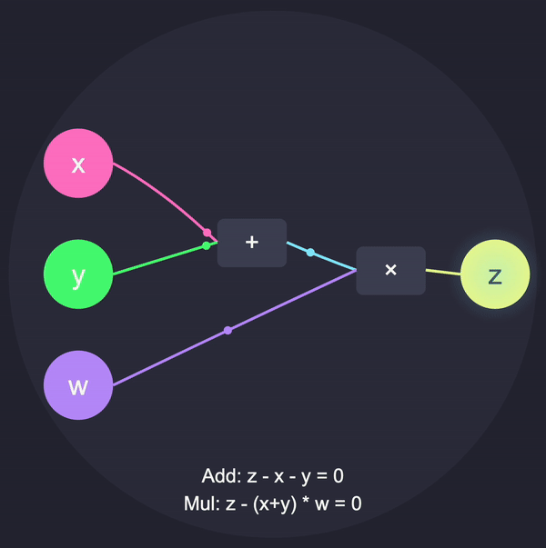

*This work is supported by a grant from the Mina Foundation*

## Arithmetic Circuits: Gates and Constraints

At the core of zk-SNARKs, including the math powering Mina, is a powerful concept called arithmetization.  The basic idea is that we can transform program into arithmetic circuits which can then be represented as low-degree polynomials. These circuits represent computations as a network of interconnected gates, where each gate performs simple arithmetic operations. The correctness of the computation is enforced through a system of constraints that the prover must satisfy to generate a valid proof.

Here you can see an extremely simple circuit in action.



**Explanation:**

1. **Add Gate:** Takes inputs \( x \) and \( y \) and outputs \( x + y \).
2. **Mul Gate:** Takes the output of the Add gate (\( x + y \)) and input \( w \), computing \( (x + y) * w \).

Mina uses a popular form of arithmetization called Plonkish.  In this note, we will do a high-level overview of basic gates and then do a deep dive into the Plonkish arithmetization used in Kimchi.  This will set us up to think about the core cryptographic protocol at a much deeper level.

## **2. Introduction to Basic Gates**
To enforce the correctness of computations within zk-SNARKs, each gate in the arithmetic circuit is associated with specific **constraints**. These constraints are algebraic equations that must hold true for the computation to be considered valid.

### **2.1. Addition Gate**
**Operation:** $z = x + y$ 

**Constraint Equation:**
$z - x - y = 0$

**Intuition:** This equation ensures that the output $z$ is exactly the sum of inputs $x$ and $y$.

### **2.2. Multiplication Gate**
**Operation:** $z = x \times y$
**Constraint Equation:**
$z - x \cdot y = 0$
**Intuition:** This equation ensures that the output $z$ is exactly the product of inputs $x$ and $y$.

### **2.3. General Gate Constraint**
In a more generalized setting, a gate can enforce a linear combination of inputs and outputs. For example:
$a_1 x + a_2 y + a_3 z + c = 0$
Where $a_1, a_2, a_3$ are coefficients, and $c$ is a constant term.

## **3. Constraint Systems**

A **constraint system** translates the computational logic of an arithmetic circuit into a set of algebraic equations that must be satisfied for the computation to be valid. In the context of arithmetization within zk-SNARKs, these constraints are often represented using matrices, enabling efficient mathematical manipulation and proof generation.

### **3.a. Arithmetization Using Matrices**

**Arithmetization** involves converting logical computations into algebraic forms. Representing constraints as matrices facilitates leveraging linear algebra techniques for efficient computation and verification. Let's explore how this abstraction is introduced and utilized.


#### **3.a.1. Matrix Representation of Constraints**

Consider an arithmetic circuit with multiple gates, each enforcing specific constraints. These constraints can be organized into matrices to systematically represent the relationships between variables and operations.

- **Variables Vector ($\mathbf{v}$):** A vector containing all the variables in the circuit, including inputs, outputs, and intermediate values.

  $\mathbf{v} = \begin{bmatrix}
  v_1 \\
  v_2 \\
  \vdots \\
  v_n
  \end{bmatrix}$

- **Constraint Matrix ($\mathbf{A}$):** A matrix where each row represents a constraint equation, and each column corresponds to a variable.

  $\mathbf{A} \cdot \mathbf{v} = \mathbf{b}$

  Here, $\mathbf{A}$ is an $m \times n$ matrix (with $m$ constraints and $n$ variables), and $\mathbf{b}$ is a vector representing the constants in each constraint equation.

#### **3.a.2. Example: Matrix Formulation**

Suppose we have a simple constraint system:

$\begin{cases}
v_1 + v_2 = v_3 \\
v_3 \times v_4 = v_5
\end{cases}$

To represent this system using matrices:

1. **Linearize the Constraints:**

   The first equation is linear, but the second is quadratic. To handle non-linear constraints, zk-SNARKs typically linearize them using auxiliary variables or polynomial representations. For simplicity, let's assume all constraints can be linearized.

2. **Define the Constraint Matrix ($\mathbf{A}$) and Constants Vector ($\mathbf{b}$):**

   $\mathbf{A} = \begin{bmatrix}
   1 & 1 & -1 & 0 & 0 \\
   0 & 0 & 1 & -v_4 & -1
   \end{bmatrix}, \quad
   \mathbf{b} = \begin{bmatrix}
   0 \\
   0
   \end{bmatrix}$

   Here, each row of $\mathbf{A}$ corresponds to a constraint equation, ensuring that $\mathbf{A} \cdot \mathbf{v} = \mathbf{0}$.

#### **3.a.3. Importance of Matrix Representation**

- **Scalability:** Efficiently handles large numbers of constraints and variables.
- **Linear Algebra Techniques:** Facilitates the use of polynomial commitments and evaluations.
- **Optimization:** Enables optimizations in proof generation and verification by exploiting matrix sparsity and structure.

---


### **3.c. Transitioning from Gates to Constraint Systems**

Understanding how individual gates translate into a global constraint system is crucial. Let's explore this transition with a high-level diagram and step-by-step explanation.

#### **3.c.1. Step-by-Step Transition**

1. **Define Gates:**

   - **Gate 1:** Logical AND to compute $s_1 = x \land x_2$
   - **Gate 2:** Multiplication to compute $s_2 = x_3 \times x_2$
   - **Gate 3:** Logical OR to compute $z = s_1 \lor s_2$

2. **Translate Each Gate to Constraints:**

   - **Gate 1 Constraint:**
     
     $s_1 - x \times x_2 = 0$

   - **Gate 2 Constraint:**
     
     $s_2 - x_3 \times x_2 = 0$

   - **Gate 3 Constraint:**
     
     $z - s_1 - s_2 + s_1 \times s_2 = 0$

3. **Assemble Constraints into a System:**

   Combine all constraints into a matrix form:

   $\mathbf{A} \cdot \mathbf{v} = \mathbf{0}$

   Where $\mathbf{v}$ includes all variables involved.

4. **Matrix Representation:**

   The constraint matrix $\mathbf{A}$ systematically encodes the relationships imposed by each gate, ensuring that the entire computation adheres to the intended logic.

#### **3.c.2. Visual Illustration: Gates to Constraints**

To further clarify the transition, consider the following diagram illustrating how individual gate constraints contribute to the overall constraint system.

```ascii
+---------+        +---------+        +---------+
| Gate 1  |        | Gate 2  |        | Gate 3  |
| AND     |        | MUL     |        | OR      |
+---------+        +---------+        +---------+
     |                  |                  |
     v                  v                  v
Constraint 1       Constraint 2       Constraint 3
     |                  |                  |
     +---------+--------+---------+--------+
               |                   |
         Constraint System Matrix
               |
            [ A ] · [v] = 0
```

**Explanation:**

- **Gates:** Represent the logical and arithmetic operations.
- **Constraints:** Algebraic equations derived from each gate's operation.
- **Constraint System Matrix ($\mathbf{A}$):** Aggregates all constraints into a linear algebraic form, facilitating efficient proof construction and verification.

---

### **3.d. Mathematical Formulation and Intuition**

To solidify understanding, let's formalize the constraint system using matrix notation and explore the mathematical intuition behind it.

#### **3.d.1. Polynomial Representation**

In zk-SNARKs, constraints are often represented as polynomials evaluated over a finite field. Each gate's constraints contribute to a global polynomial that must evaluate to zero across the entire domain.

- **Gate Constraints:**

  For each gate $i$:

  $C_i(X) = S_{+}(X) \cdot (Z_i(X) - L_i(X) - R_i(X)) + S_{\times}(X) \cdot (Z_i(X) - L_i(X) \cdot R_i(X))$

  Where:
  
  - $S_{+}(X)$ and $S_{\times}(X)$ are selector polynomials determining the gate type.
  - $L_i(X)$, $R_i(X)$, and $Z_i(X)$ are polynomials representing the left input, right input, and output of gate $i$.

- **Global Constraint Polynomial:**

  $C(X) = \sum_{i=1}^{m} C_i(X) = 0 \quad \forall X \in \text{Domain}$

#### **3.d.2. Matrix Representation Revisited**

The polynomial constraints can be represented in matrix form for computational efficiency:

$\mathbf{A} \cdot \mathbf{v} = \mathbf{0}$

Where:
- $\mathbf{A}$ encodes the coefficients from all constraints.
- $\mathbf{v}$ is the vector of variable assignments (including intermediate variables).

#### **3.d.3. Intuition Behind Matrix-Based Constraint Systems**

- **Linearization of Constraints:** By organizing constraints into a matrix, complex computations are transformed into linear algebra problems, which are well-understood and efficiently solvable.
- **Scalability:** Matrix operations scale gracefully with the size of the computation, allowing zk-SNARKs to handle large circuits.
- **Polynomial Commitment:** Leveraging matrices aligns with polynomial commitment schemes used in zk-SNARKs, facilitating secure and efficient proof generation.

---

### **3.e. Summary of Constraint Systems Formulation**

- **Matrix Abstraction:** Constraints are systematically organized into matrices, enabling the use of linear algebra for efficient computation and verification.
- **Mathematical Foundation:** Polynomial and matrix representations provide a robust mathematical framework for understanding and implementing zk-SNARKs in the real world protocol.

By mastering the formulation of constraint systems through matrices and understanding the translation from gates to algebraic constraints, we lay the groundwork for deeper exploration into more advanced topics like PLONK-specific mechanisms and lookup tables within the Mina protocol.

